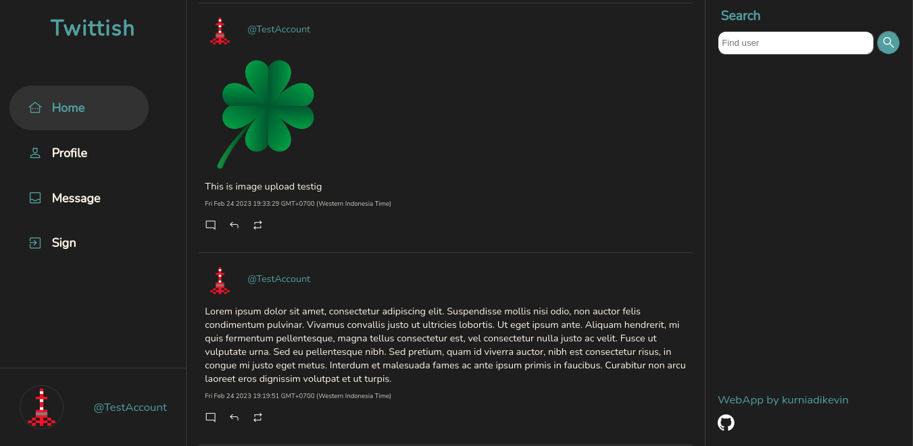

# Twittish

## Description

Twitter style social media application for Front end project using React.js and Firebase for serverless database and authentication.

Development mode can be run using npm on command ```npm run start```

Deployed using Firebase

**Deployment** on [Twittish deployment](https://twittish-newdb.web.app/)<br>
**Repository** on [Twittish repository](https://github.com/kurniadikevin/twittish/tree/deploy)


